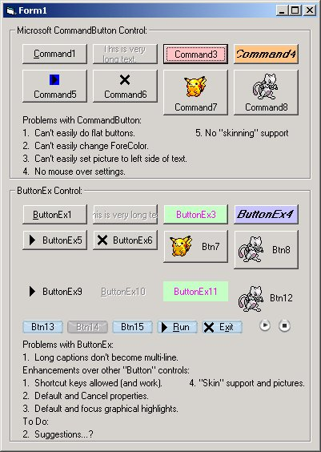



## ButtonEx v1\.1

### Description

Updated version of ButtonEx control replacement for CommandButton. Provides more control over the pictures displayed when mouse down, mouse up, mouse over and has focus. Provides "skin" support alongside of picture support.

Did you ever wonder how WinAmp and other programs make the button "glow" when you move your mouse over them or press them? ButtonEx provides that through "skins" for each individual button state (up, over, down, focus, disabled).
 
### More Info
 
Dizziness

             |
---                |---
**Submitted On**   |2000-09-01 16:56:02
**By**             |[Nightshadow](https://github.com/Planet-Source-Code/PSCIndex/blob/master/ByAuthor/nightshadow.md)
**Level**          |Intermediate
**User Rating**    |4.8 (29 globes from 6 users)
**Compatibility**  |VB 6\.0
**Category**       |[Custom Controls/ Forms/  Menus](https://github.com/Planet-Source-Code/PSCIndex/blob/master/ByCategory/custom-controls-forms-menus__1-4.md)
**World**          |[Visual Basic](https://github.com/Planet-Source-Code/PSCIndex/blob/master/ByWorld/visual-basic.md)
**Archive File**   |[CODE\_UPLOAD9506912000\.zip](https://github.com/Planet-Source-Code/nightshadow-buttonex-v1-1__1-11170/archive/master.zip)

